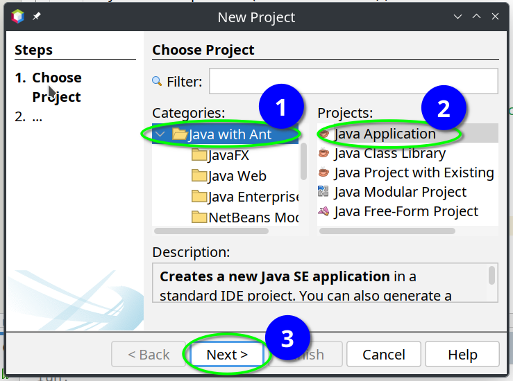

# Ejercicios para la clase 02
En esta clase vimos variables, constantes y expresiones.

Primeros pasos para estos ejercicios:

- Abrir la IDE (Netbeans)
- Crear un nuevo programa (o abrir uno existente)
    - Si estás creando uno nuevo, acordate de seleccionar la opción "Java with Ant".
    


**NOTA:** Para todos estos ejercicios, cuando proponemos mostrar 'cosas' por consola, agreguen además un pequeño texto
descriptivo antes del resultado o valor, así se entiende qué es lo que estamos imprimiendo :material-console: :material-heart:

Ejemplo:

```java
  int desde = 2003;
  int hasta = 2015;
  int laDecadaGanada = hasta - desde;

  System.out.println("La década ganada duró: " + laDecadaGanada + " años.");
```

## Ejercicio 01: Suma de enteros
Declará dos variables enteras `a` y `b`, asignales valores y mostrá por consola la suma de ambas.

## Ejercicio 02: Área de un rectángulo
Escribí un programa que calcule el área de un rectángulo, utilizando la fórmula `base * altura`.
Declará una variable para la base y otra para la altura, ambas de tipo `double`.
Finalmente, mostrá el resultado en la consola.

## Ejercicio 03: Promedio de tres números
Imaginemos que tenemos que sacar el promedio de una materia que tuvo 3 exámenes en el cuatrimestre.

Escribí un programa en el que:

1. Cada nota sea una variable de tipo **entera** (`int`) 
2. Se calcule el promedio de las 3 notas
3. El promedio se guarde en otra variable que debemos mostrar por consola, **con decimales** (OJO: ¿qué tipo debemos usar
para mostrar decimales?)

## Ejercicio 04: Intercambio de valores
Escribí un programa en el que inicialmente tengas dos variables (`x = 5` e `y = 10`) y luego intercambiá sus valores y
mostrá el resultado por consola.

## Ejercicio 05: Conversión de temperatura
Imaginemos que tenemos un tío paquete que vive en Nueva York y cada vez que hablamos por teléfono nos pregunta cómo está
el clima en Buenos Aires. Sabiendo que en Argentina utilizamos la escala de temperatura en grados Celsius (°c) y que en
Estados Unidos utilizan la escala Fahrenheit (°f), escribamos un programita que nos ayude a convertir la temperatura de
Celsius a Fahrenheit para ahorrarnos la engorrosa tarea de hacer esta operación manual cada vez que hablamos con él.

1. Declará una variable para guardar la temperatura actual de Buenos Aires en grados Celsius.
2. Usá la fórmula $`F = (C * 9/5) + 32`$ para convertir escalas.
3. Guardá la temperatura en F en una variable y
4. Mostrá la temperatura en F por consola

## Ejercicio 06: Cálculo de sueldo
Guardá en variables el sueldo base y un bono extra. Calculá el sueldo total y mostralo. (Pensá si los sueldos y el bono
son valores enteros o reales)

## Ejercicio 07: Edad en meses y días
Porque nunca está de más ser extravagante, escribí un programa que muestre tu edad en meses y en días (aproximados,
usando 365 días para un año, -a los bisiestos los ignoramos por un momentito).

Mostrá ambos resultados en la consola.

## Ejercicio 08: Concatenación de cadenas
Utilizá una variable para guardar tu primer nombre y otra para guardar tu apellido.
Mostrá por consola un mensaje que diga `Hola, [nombre] [apellido]`.

## Ejercicio 09: Número par o impar
Utilizá una variable de tipo entera para guardar un número, mostrá en consola si el número es par o impar.

## Ejercicio 10: Hipotenusa (Teorema de Pitágoras)

1. Utilizá dos variables `catetoA` y `catetoB` (`double`) para guardar los valores de los catetos de un triángulo,
2. calculá la hipotenusa con la fórmula: $`h = \sqrt{a^2 + b^2}`$
3. y mostrá el resultado por consola