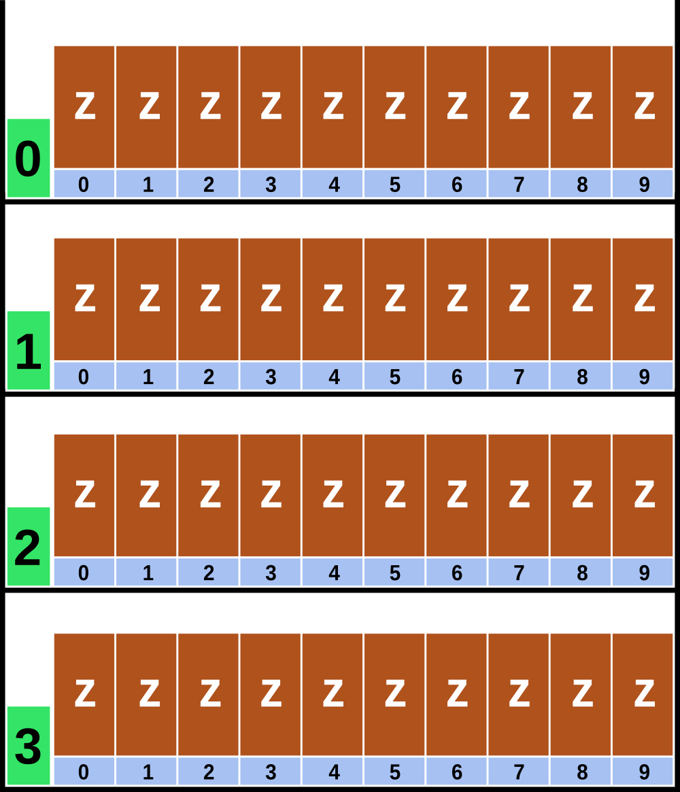
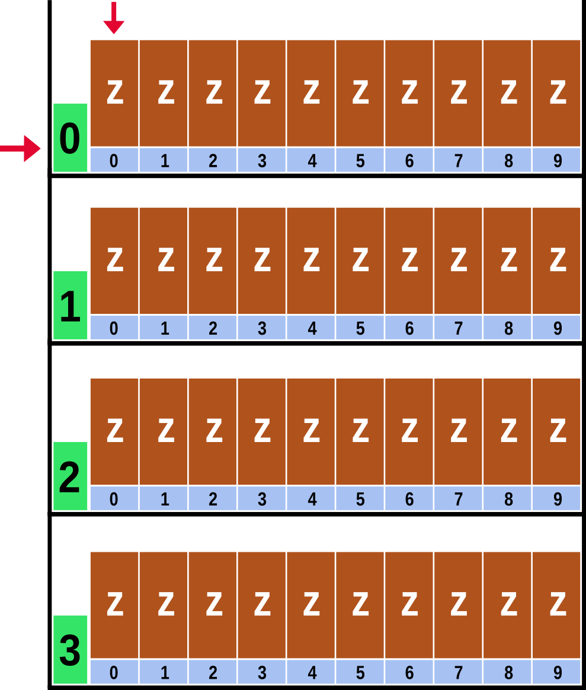
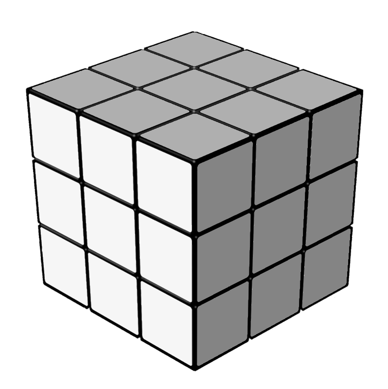
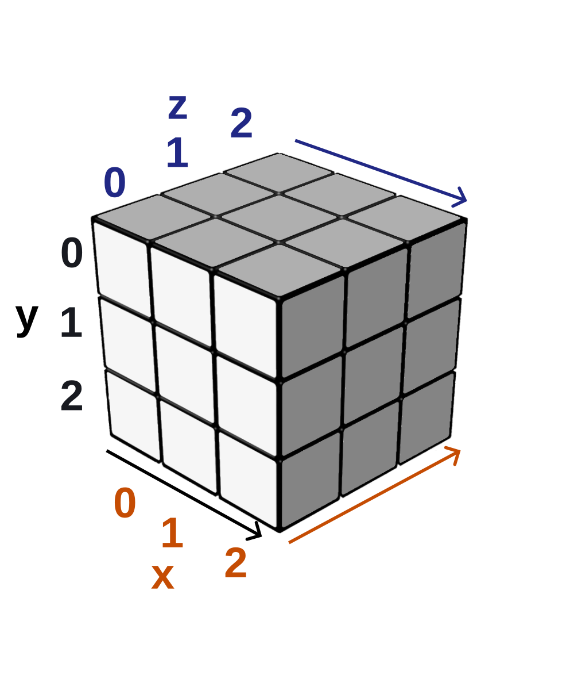
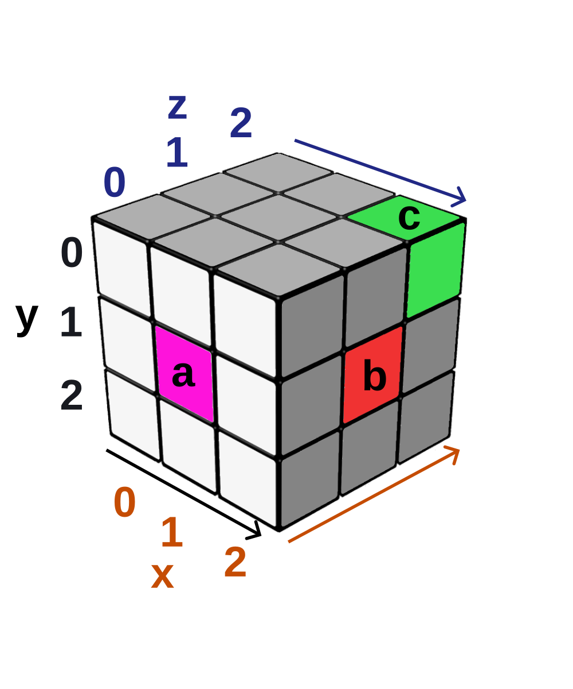
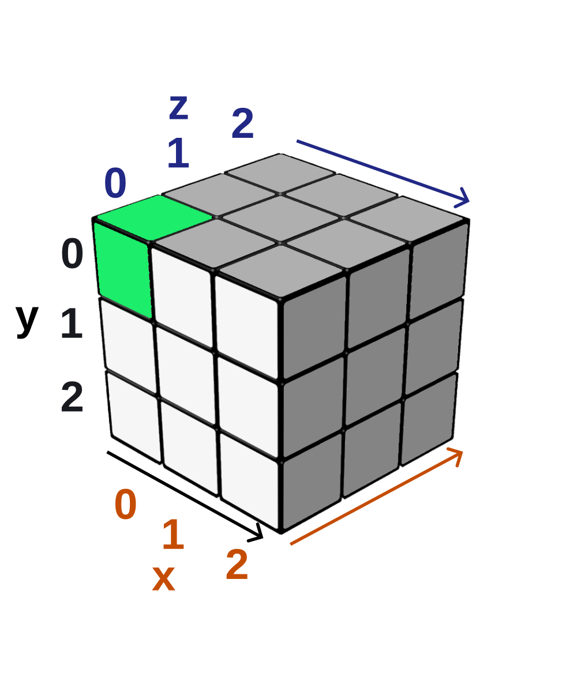
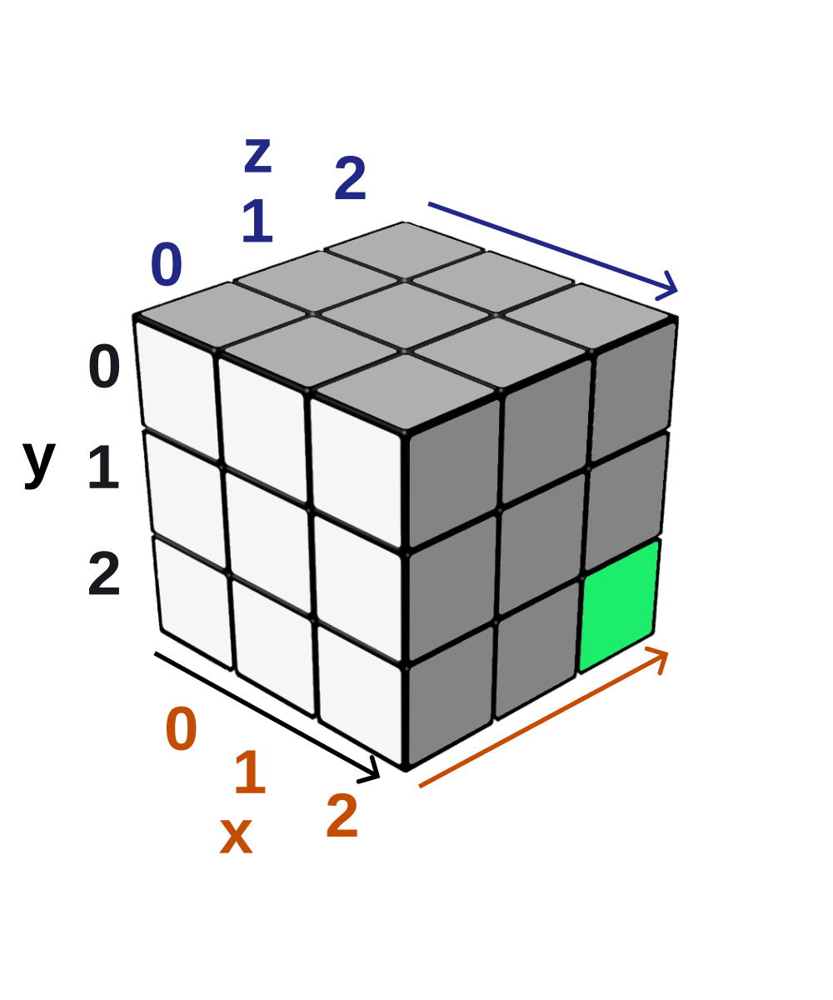

# Clase 04: Arrays (vectores y matrices)

## Definición

Los arrays en java son una colección ordenada, indexada y de tamaño fijo. Cuyos elementos pueden cambiar de valor pero
no de tipo.

Esto que a primera vista es complejo y confuso lo vamos a ir desgranando paso a paso para entenderlo. 


## {==Vectores (Arrays unidimensionales)==}

Empecemos por este tipo de array para adentrarnos en estos conceptos.

Imaginemos que tenemos un estante donde ubicamos una serie de cajas, por ej: 10 cajas.
Es importante que las cajas sean iguales y pueden contener un solo tipo de elemento, por ejemplo: zapatillas.
Debajo de cada caja vamos a numerar el orden de las cajas.

Acá hagamos una aclaración:
Naturalmente si nosotros les decimos que numeren el orden de las cajas, ustedes harían: **1, 2, 3, ... 10**,
pero para nuestro ejemplo lo vamos a hacer iniciando en 0. O sea, nos quedará: **0, 1, 2, 3, ... 9**.

¿Por qué es esto?

Porque tenemos que recordar que el 0 para nosotros es un valor (existe) y siempre lo tomamos como el primer número
entero positivo.

Si volvemos a nuestro ejemplo nos quedaría algo parecido a la imagen:


Pasemos a trabajar con un Array unidimensional en java.

Crear un vector no es otra cosa que crear una variable y declarla de una manera que el compilador entienda que lo 
que estamos creando es un array.

A lo que ya sabemos en la declaración de una variable del tipo entera:

```java
int numero = 4;
```

La modificamos de está manera:

```java
int[] numeros =    new int[3];
 ^      ^     ^      ^
TIPO   ID     OP    VALOR
```

Como podemos ver, a el formato que aprendimos al declarar variables le hicimos algunos cambios.

Analicemos lo que cambió:

En el TIPO: Le agregamos el modificador [] (corchete de apertura y de cerrado)

Ese modificador le dice al compilador que estamos creando un array.

Y finalmente después del operador relacional "=" vemos que para el valor usamos: **new int[3]**;

Si aprovechamos la analogía de nuestro estante, estamos diciendo:

Vamos a crear un estante nuevo con 3 cajas.

Si ajustamos nuestro código a la analogía de nuestro estante haríamos esto:

```java
int[] numeros = new int[10];
```

Creamos un estante con 10 cajas para guardar enteros.

Es importante entender que solo estamos creando el estante con las cajas y su número identificador, pero todavía 
no hemos puesto números adentro de esas cajas.

Tendríamos esto:
```
Caja 0 -> vacía
Caja 1 -> vacía
Caja 2 -> vacía
Caja 3 -> vacía
...
Caja 9 -> vacía
```
Ahora bien. Lo que necesitamos ahora es llenar esas cajas.

Pasando a nuestro código lo hacemos así:


```java
int[] numeros = new int[4];

numeros[0] = 25;
numeros[1] = 2;
numeros[2] = -8;
numeros[3] = 123;
```

Como podemos ver usamos el identificador del array con el número de orden (índice) entre corchetes para que el 
compilador sepa exactamente donde ubicar el valor.

O sea en la primera caja, que tiene como índice 0, le ponemos el valor 25 adentro.

En la segunda caja, con el índice 1, le ponemos el valor 2 adentro.

En la tercera caja, con el índice 2, le penemos el valor -8 adentro.

En la cuarta caja, con el índice 3, le penemos el valor 123 adentro.


### Si queremos ver por consola el contenido de algún elemento del arrays, hacemos

```java
System.out.println(numeros[0]); // muestra el contenido de la caja 0 → imprime 25
System.out.println(numeros[1]); // muestra el contenido de la caja 1 → imprime 2
System.out.println(numeros[2]); // muestra el contenido de la caja 2 → imprime -8
System.out.println(numeros[3]); // muestra el contenido de la caja 3 → imprime 123
```


### Ahora cambiemos algún valor de los ya asignados a nuestro array

Si hacemos esto

```java
numeros[2] = 1000;
```

Cuando lo mostremos por consola, veremos esto:
```java
System.out.println(numeros[0]); // muestra el contenido de la caja 0 → imprime 25
System.out.println(numeros[1]); // muestra el contenido de la caja 1 → imprime 2
System.out.println(numeros[2]); // muestra el contenido de la caja 2 → imprime 1000
System.out.println(numeros[3]); // muestra el contenido de la caja 3 → imprime 123
```


### Por último veamos otra manera de declarar un array.

Podemos crear el array y darle valores a cada índice en la misma declaración. Lo único que cambia es la forma de
darle valor después del operador relacional


```java
int[] numeros = {55,1, 0, 29, 44, 100};
```

En este caso estamos creando un estante con 6 cajas y al mismo tiempo las llenamos con esos valores.

En la primera caja, que tiene como índice 0, le ponemos el valor 55 adentro.

En la segunda caja, con el índice 1, le ponemos el valor 1 adentro.

En la tercera caja, con el índice 2, le penemos el valor 0 adentro.

En la cuarta caja, con el índice 3, le penemos el valor 29 adentro.

En la quinta caja, con el índice 4, le penemos el valor 44 adentro.

En la sexta caja, con el índice 5, le penemos el valor 100 adentro.


Al hacerlo de está manera el compilador entiende que cada coma separa un valor de otro.

## {==Matrices (Arrays bidimensionales)==}

Ahora ampliemos la analogía que usamos para el vector.

Vamos a crear una estantería en lugar de solo un estante. Entonces vamos a tener varios estantes del mismo tamaño





Fíjense que ahora cada estante tiene otro índice.

Para que lo veamos claramente lo pusimos en color verde.

Tenemos 4 filas (los números en verde) y cada fila tiene 10 columnas (los números en celeste)

En nuestra estantería armamos un primer estante (0, recordemos que nuestro primer número natural es 0, no 1) con 
10 cajas.

De la misma manera para el segundo: Tendrá el índice 1 y 10 cajas también.

Así hasta el último estante = 3.

Es importante recordar que no puede hacer un estante con 3 cajas. Todos los estantes tienen el mismo tamaño.

Vayamos a como lo declaramos nuestra estantería en java.


```java
int[][] matriz = new int[4][10];
```
Fíjense que es similar al vector, solo le agregamos otra dimensión.

En el vector hacíamos, por ejemplo
```java
int[] vector = new int[10];
```

Solo decimos cuantos lugares va a tener el estante. En este caso va a tener 10 lugares.

En la matriz le agregamos cuantas filas va a tener.

Esa nueva dimensión va antes de lo que teníamos, por eso [4] va antes de las columnas:


```java
int[][] matriz = new int[4][10]
```
Ahora hablemos de como el asignamos valores. Como hay dos dimensiones si queremos darle valor a nuestra
matriz tenemos que especificar a qué fila y qué columna nos referimos.

Si queremos cargar un valor en el primer lugar. Nuestra primer caja de nuestro primer estante




Lo hacemos así:

```java
matriz[0][0] = 22;
```

Es la fila 0 y la columna 0.

Si queremos llenar más cajas de nuestro primer estante tenemos que usar la referencia al estante y 
vamos cambiando la caja donde guardar el valor. Por ej: el primer estante con la segunda y tercer caja.


```java
matriz[0][1] = 13;
matriz[0][2] = 8;
```

¿Y si queremos guardar en la décima caja?


```java
matriz[0][9] = 2;
```

¿Y si queremos guardar en la cuarta caja del tercer estante?


```java
matriz[2][3] = 55;
```

De manera similar si lo queremos mostrar por consola. Tenemos que hacer referencia a los dos 
índices: el de la fila y el de la columna.

```java
System.out.println(“Mostramos el último valor que agregamos: ” + matriz[2][3]);
```


### Ahora vamos a declarar la matriz y asignarle valores a las posiciones, lo hacemos de está manera.

```java
int [ ][ ] numeros = {{72,55,89},{21,3,1}};
```

Separemos por grupos para ver como se construye la asignación de valores.


Tomemos la parte de asignación de valores -> {{72,55,89},{21,3,1}}


Las primeras llaves { } corresponden al bloque que corresponde a la matriz completa.

Las llaves interiores separadas por la coma (,) agrupan los valores por fila y columna.

Por lo tanto {72,55,89} son los valores de la primera fila, la que tiene índice 0 y las columnas de esa fila.

Fila 0 → Columna 0 = 72
Fila 0 → Columna 1 = 55
Fila 0 → Columna 2 = 89

El otro grupo {21,3,1} son los valores de la segunda fila, con índice 1 y sus correspondientes columnas.

Fila 1 → Columna 0 = 21
Fila 1 → Columna 1 = 3
Fila 1 → Columna 2 = 1
La impresión por consola es igual a lo que ya hemos hecho.

## {==Matrices (Arrays tridimensionales)==}

Algo importante a tener en cuenta es que se puede agregar una capa más.

Este escenario es del caso de la programación y diseño 3D. Por ejemplo: Unity.

Unity es un motor de videojuegos que se programa y diseña en 3D.

Vayamos a ver un ejemplo.

Supongamos que nuestra estantería es como un cubo: 3 estantes con 3 cajas en cada columna y 3 filas de cajas 
en cada estante. 

 


Para poder usarlo como figura de referencia tenemos que determinar sobre que lados vamos a 
identificar nuestras filas, columnas y la profundidad del cubo.

 


O sea todos los lugares del cubo se van a identificar de está forma general: 

cubo[x][y][z]


En la figura marcamos cada eje, su índice y la “dirección” en la que tiene su dominio con un mismo color.
 
El eje X es en color naranja, el eje Y en negro y el eje Z en azul.

Ahora marquemos 3 lugares de nuestro cubo para poder determinar sus coordenadas.

Veamos la siguiente figura:


 


Podemos ver los lugares donde están a, b y c.

Para el lugar “a” vemos que está en línea con la coordenada 1 de X. La coordenada 1 de Y. Pero no tiene 
desplazamiento sobre el eje Z, está al frente del cubo. O sea corresponde con la coordenada 0 del eje Z.

Obviando por ahora la sintaxis de java podemos identificar el punto a de la siguiente manera.


cubo[1][1][0] 


Analicemos el punto “b”. Sobre el eje X está en la coordenada 2. Sobre el eje Y está en la coordenada 1 y tiene 
la coordenada 1 del eje Z.

Por lo tanto lo podemos identificar así:


cubo[2][1][1] 


Por último tenemos el punto “c” que su coordenada X es 2, su coordenada Y es 0 y la coordenada Z es 2.

Nos quedaría así:


cubo[2][0][2]

Ahora pasemos a como declaramos una matriz tridimensional en java.

Sigamos con el tamaño de la matriz que tenemos en la figura, la declaramos así

```java
int[ ][ ][ ] matriz3D = new int[3][3][3];
```

Recuerden que al igual que en el caso del vector y de la matriz bidimensional en este tipo de declaración 
hacemos una matriz nueva indicando solo el tamaño. No le estamos asignando valores a la matriz.


Para asignarle valores hacemos parecido a lo que ya hicimos en los casos anteriores solo que necesitamos indicar 
las 3 coordenadas.

Vamos a ingresar un valor en la primera ubicación de la matriz. La 0, 0, 0.


 


```java
matriz3D[0][0][0] = 77;
```

Si por el contrario queremos ingresar un valor en la última ubicación de la matriz, sería:
```java
matriz3D[2][2][2] = 134;
```

Y en la figura sería el punto que está al fondo y abajo a la derecha.


 


Ahora nos falta crear la matriz y asignar valores al mismo tiempo.

Como referencia tenemos que pensar que necesitamos un par de llaves de apertura y de cierre por cada capa 
que agreguemos a nuestra matriz.
Nuestra matriz, la de la figura es de 3 x 3 x 3. Al crearla vamos a tener esto:


```java
int[][][] cubo = { // Está llave representa al contenedor más grande que sería el cubo en sí
            
            {//Está llave es la apertura de todas las posiciones de la fila 0
                
                {72,55,89}, {21,3,1}, {18,19,4}
                    
            },
            {//Está llave es la apertura de las posiciones correspondiente a la fila 1
                
                {33,5,6}, {12,0,8}, {129,65,113}
                    
            },
            { //Está llave es la apertura de las posiciones correspondiente a la fila 2
                {77,54,7}, {88,11,71}, {54,7,10}
            }
        
    };
```
Tomemos este trozo de código:

{72,55,89}, {21,3,1}, {18,3,4}

Aquí tenemos que **cada coma entre las llaves separa las columnas y cada número separado por coma es la 
posición correspondiente a la profundidad: El eje Z**


Por ejemplo si quiero imprimir por consola el valor 129 que está en está parte del código:

```java
{ // Está llave es la apertura de las posiciones correspondiente a la fila 1

        {33,5,6},  {12,0,8},  {129,65,113}

	 // Columna0,  Columna1,  Columna2
},
```

Lo haríamos así:

```java
System.out.println("Valor que se encuentra en el lugar [1][2][0]: " + cubo[1][2][0]);
```


## En resumen 


### Definición técnica en Java


**Array (vector 1D):**

1. Ordenado en una dimensión
2. Tamaño fijo (cantidad de elementos)
3. Acceso indexado con 1 índice
4. Mutable en contenido


**Array bidimensional (matriz 2D):**

1. Ordenado en dos dimensiones (filas y columnas)
2. Tamaño fijo (cantidad de filas y de columnas)
3. Acceso indexado con 2 índices [fila][columna]
4. Mutable en contenido


**Array tridimensional (cubo 3D):**

1. Ordenado en tres dimensiones (ejes X, Y y Z)
2. Tamaño fijo en cada dimensión
3. Acceso indexado con 3 índices [x][y][z]
4. Mutable en contenido
5. Puede pensarse como un conjunto de matrices 2D apiladas
