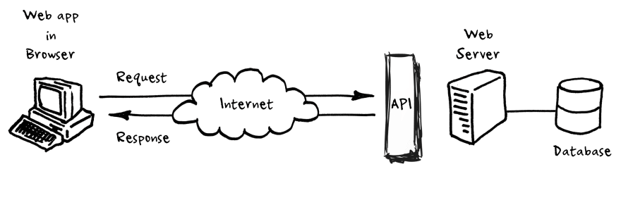

# Clase 07: API de Java
El término API viene del inglés _Application Programming Interface_ y lo podríamos traducir como Interfaz de Programación
de Aplicaciones.

Ejemplo del mozo como la API entre servidor (cocina) y cliente. Pedido del cliente (request), platos (response).

